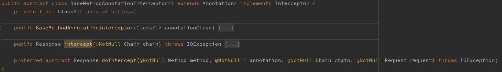

<p align="center">
    <br/>
    <br/>
    <b>用于在spring-boot微服务中集成retrofit2的starter</b>
    <br/>
    <br/>
</p>

在微服务架构中，除依赖基于内网RPC的内部服务外，通常还会依赖基于Http协议的外部服务。那些外部服务通常使用JSON作为序列化方案，并使用多样的认证策略、加密逻辑。

为了减少Http请求的样板代码和硬编码，可以借助Interface和Annotation实现声明式的**Api DSL**，通过动态代理劫持方法调用透明的进行Http请求。基于该思路的常用解决方案有[Feign](https://github.com/OpenFeign/feign)和[Retrofit2](https://github.com/square/retrofit)。
- Feign是Spring-Cloud生态中的Http请求组件，主要用户服务端RPC，和Spring IOC有很好的亲和性，但和Spring—Cloud系列组件耦合太深，依赖树太庞大。
- Retrofit2是一个简单轻量的Http请求门面,但主要用于安卓客户端编程，在服务端开发中往往需要写一些样板代码，没法借助Spring的IOC实现依赖注入。

该项目旨在为Retrofit2提供一个简单的胶水层，使其生成的API Stub能透明的在Spring容器中注册，方便在业务代码中注入使用。

# 要求
- Spring-boot 2.x
> 本项目依赖 Spring-Boot 2.0.8 核心基础API开发测试，且没有传递Spring-Boot依赖，理论上兼容所有Spring-Boot版本。
- Java8

# 特性
- 继承Retrofit原生特性   
- 方法级动态设置超时，[查看](src/main/java/com/github/yungyu16/spring/http/annotion/RequestTimeout.java)   
- 封装OkHttp拦截器方便基于注解拓展，[查看](src/main/java/com/github/yungyu16/spring/http/interceptor/BaseMethodAnnotationInterceptor.java)   
- 基于SPI引入既有HttpClient实例,方便老项目集成，[查看](src/main/java/com/github/yungyu16/spring/http/OkHttpClientLoader.java) 
- 基于Spring IOC的OkHttp动态拦截器链，[查看](src/main/java/com/github/yungyu16/spring/http/annotion/HttpInterceptor.java)  

# 集成
已发布到中央仓库，GAV坐标如下：
```xml
<plugin>
    <groupId>com.github.yungyu16.spring</groupId>
    <artifactId>spring-boot-starter-retrofit2</artifactId>
    <version>1.0.0</version>
</plugin>
```
> 查看[release-tag](https://github.com/yungyu16/spring-boot-starter-retrofit2/releases)      
> 在[maven](https://search.maven.org/artifact/com.github.yungyu16.spring/spring-boot-starter-retrofit2)中查看

本项目借助AutoConfiguration实现了零配置，开箱即用；默认扫描的basePackages为 `@SpringBootApplication` 入口类所在包。     
如需添加自定义扫描路径，请使用 `@HttpClientScan` 注解配置，该注解使用方式和 `@ComponentScan` 类似。

# 使用
## 定义Stub接口
```java
@HttpClient("https://xxx.com/xxx") //指定接口baseUrl
@ReqConverterType(GithubReqBodyConverter1.class) //指定RequestBody转换器
@ReplyConverterType(GithubReplyBodyConverter1.class) //指定ResponseBody转换器
@HttpInterceptor(TestInterceptor1.class) //添加拦截器
@HttpInterceptor(value = TestInterceptor2.class,index = 100) //添加拦截器,并指定顺序
public interface GithubClient {

    @POST("xxx/xxx")
    @RequestTimeout(readTimeout = 10) //指定接口超时
    Response<LoginVO> listRepos1(@Body LoginForm form);

    @POST("xxx/xxx")
    @ReqConverterType(GithubReqBodyConverter2.class) //方法级RequestBody转换器
    @ReplyConverterType(GithubReplyBodyConverter2.class) //方法级ResponseBody转换器
    Response<LoginVO> listRepos2(@Body LoginForm form);
}
```

## 定义请求转换器
```java
@Component
public class GithubReqBodyConverter implements ReqBodyConverter {
    @Override
    public RequestBody toRequestBody(@NotNull Object entity, Type type) {
        return RequestBody.create(JSON.toJSONBytes(entity), CONTENT_TYPE_JSON);
    }
}
```

## 定义响应转换器
```java
@Component
public class GithubReplyBodyConverter implements ReplyBodyConverter {

    @Override
    public Object fromResponseBody(@NotNull ResponseBody body, Type type) throws IOException {
        return JSON.parseObject(body.string(), type);
    }
}
```

# 拓展点
### SPI OkHttpClient提供者
如文档所述，OkHttpClient应为全局单例，为共享项目中既有的OkHttpClient实例，提供了基于SPI的提供者接口。    
默认使用`DefaultOkHttpClientLoader`构建新的OkHttpClient实例，可实现`OkHttpClientLoader`接入既有OkHttpClient实例；代码实例如下
```java
public class DefaultOkHttpClientLoader implements OkHttpClientLoader {
    private static volatile OkHttpClient HTTP_CLIENT;

    @Override
    public OkHttpClient getBaseHttpClient() {
        if (HTTP_CLIENT == null) {
            synchronized (DefaultOkHttpClientLoader.class) {
                if (HTTP_CLIENT == null) {
                    HttpLoggingInterceptor interceptor = new HttpLoggingInterceptor(HttpLogger::info);
                    interceptor.level(HttpLoggingInterceptor.Level.BODY);
                    HTTP_CLIENT = new OkHttpClient.Builder()
                            .addInterceptor(interceptor)
                            .connectTimeout(5, TimeUnit.SECONDS)
                            .readTimeout(5, TimeUnit.SECONDS)
                            .writeTimeout(5, TimeUnit.SECONDS)
                            .build();
                }
            }
        }
        return HTTP_CLIENT;
    }
}
```

## 注解拦截器
已实现基于注解和OkHttp拦截器的拓展机制，拓展的抽象基类为`BaseMethodAnnotationInterceptor`。

子类通过实现`BaseMethodAnnotationInterceptor.doIntercept`方法并结合自定义注解达到拦截请求实现自定义逻辑；具体思路可参考[RequestTimeoutInterceptor](src/main/java/com/github/yungyu16/spring/http/interceptor/RequestTimeoutInterceptor.java) 。
```java
protected abstract Response doIntercept(@NotNull Method method, @NotNull T annotation, @NotNull Chain chain, @NotNull Request request) throws IOException;
```
